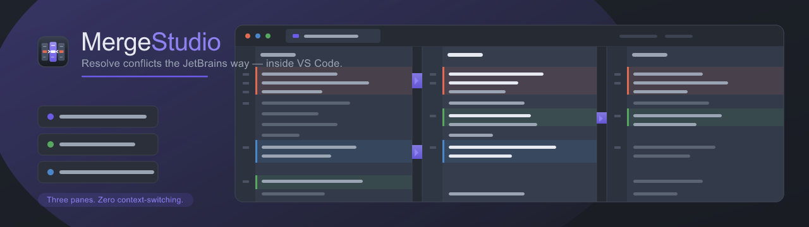
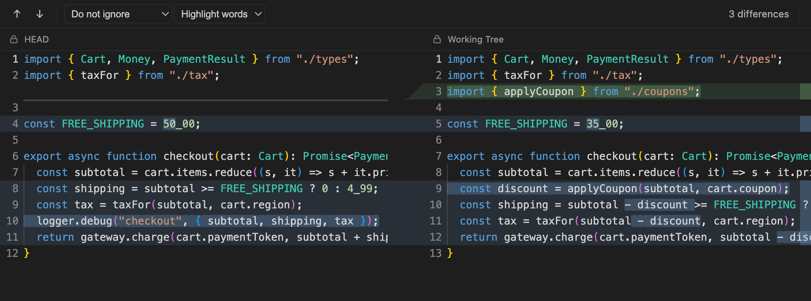

<h1 align="center">Merge Studio</h1>

<p align="center">
  <b>The merge editor for VS Code and Cursor.</b><br>
  <b>Resolve conflicts with confidence.</b>
</p>

<p align="center">
  <a href="https://marketplace.visualstudio.com/items?itemName=gitstudio.merge-studio"></a>
  <a href="https://marketplace.visualstudio.com/items?itemName=gitstudio.merge-studio"></a>
  <a href="https://open-vsx.org/extension/gitstudio/merge-studio"></a>
  <a href="https://open-vsx.org/extension/gitstudio/merge-studio"></a>
  <a href="LICENSE"></a>
</p>

<p align="center">
  
</p>

VS Code and Cursor never had a real merge editor. **So I built it.**

**Merge Studio is that merge editor.** Your version and theirs sit side by side, with the result you'll commit in the middle. Take a side with one click, or edit the result yourself — without ever leaving your editor.

And you do it without fear. **No change is irreversible** — undo anything, or roll a file back to its original conflict. **No conflict is missed** — every one is tracked until it's settled. **Everything's in plain sight** — no markers to untangle, no guessing what you're about to commit.

Runs in VS Code, Cursor, and any editor on the [Open VSX Registry](https://open-vsx.org/extension/gitstudio/merge-studio) — the real merge editor, native to the platform you already work in.

---

## Three-pane merge editor

<p align="center"></p>

Left is **yours**, the center is the **result** you commit, right is **theirs** — connected by color ribbons and accept arrows. Large, multi-line conflicts stay legible: each side's hunk is framed, the ribbons show exactly where it lands, and you pull a side into the result with a single click. Edit the result freely; alignment re-flows live as you type.

- Per-change resolution — apply (≫ / ≪), append (Ctrl-click), or ignore (✕) each change independently
- Apply every non-conflicting change at once (left / right / all), plus a magic-wand for identical edits
- **Undo / redo with a named action history** — ⌘Z / ⇧⌘Z, toolbar buttons, and a history dropdown
- Curved ribbons connect changes across panes, with crisp frames around true conflicts
- Two-intensity highlighting that keeps syntax colors readable
- Change navigation (F7 / ⇧F7), synchronized scrolling, whitespace modes, and a large-file fallback

## Conflicts dashboard

<p align="center"></p>

The moment a merge, rebase, cherry-pick, or revert produces conflicts, the **Conflicts** page opens automatically — accelerated by direct `.git` operation-state watchers that poke git to re-scan as soon as a merge starts, instead of waiting on its slower poll. It's the cockpit for the whole merge.

- Every conflicted file with **Accept Yours · Accept Theirs · Merge…** actions, and badges for the tricky cases (deleted by them, added by both, …)
- Resolved files stay in the list — green, check-marked, and labeled with how they were settled
- **Hold-to-undo** on any resolved file: a brief press-and-hold runs `git checkout -m` to restore the original conflict
- **Cancel Merge** aborts the operation and restores the pre-merge state (merge, rebase, cherry-pick, revert)
- Live progress bar, branch context (`yours ⟵ theirs`), and a ⚠ status-bar button while conflicts remain

<p align="center"></p>

## Side-by-side diff

<p align="center"></p>

- **Compare** any two files, or a single file against its git `HEAD` — Explorer right-click or the `Merge Studio: Compare` command
- Line-for-line alignment with intra-line highlights on exactly what changed
- Live re-diff as you edit the right pane
- The same ribbons, colors, and navigation as the merge editor

## Open in a JetBrains IDE

Prefer to resolve in a JetBrains IDE? Set `jbMerge.conflictResolver: "jetbrains"` (or `jbMerge.diffTool: "jetbrains"`) and Merge Studio opens the merge or diff directly in your installed IDE — WebStorm, PyCharm, IntelliJ IDEA, PhpStorm, GoLand, CLion, Rider, RubyMine, or DataGrip, auto-detected from your `PATH` or `/Applications`.

## Install

**VS Code** — search **Merge Studio** in the Extensions view, or:

```bash
code --install-extension gitstudio.merge-studio
```

**Cursor / VSCodium / Windsurf / Gitpod** — via the [Open VSX Registry](https://open-vsx.org/extension/gitstudio/merge-studio):

```bash
cursor --install-extension gitstudio.merge-studio
```

…or replace `cursor` with `codium` / `windsurf`, or install from the Open VSX UI.

**Sideload a `.vsix`** — download the latest from [GitHub Releases](https://github.com/GitStudioHQ/merge-studio/releases/latest):

```bash
code --install-extension merge-studio-<version>.vsix
```

New here? Run **Merge Studio: Open Getting Started** from the Command Palette for a guided tour with a ready-made sample conflict — no repo setup required.

## Settings

| Setting | Default | Description |
| --- | --- | --- |
| `jbMerge.conflictResolver` | `webview` | `webview` = embedded editor, `jetbrains` = launch the real installed IDE |
| `jbMerge.diffTool` | `embedded` | Tool for the **Compare** command: `embedded`, or `jetbrains` (falls back to embedded if no IDE is found) |
| `jbMerge.autoOpen` | `true` | Automatically open conflicted files with the selected resolver |
| `jbMerge.preferredIde` | `auto` | Which JetBrains IDE to launch for hand-off (`auto` picks the first one found) |
| `jbMerge.jetbrainsPath` | `""` | Explicit path to a JetBrains IDE launcher (overrides auto-detection) |

## Requirements

VS Code **1.74+** (or Cursor), **git** on your `PATH`, and the built-in Git extension enabled. Merge Studio operates on a repository on disk, so it needs a trusted, non-virtual (local) workspace.

## Development

```bash
npm install              # install dependencies
npm run watch            # incremental build (extension + webview)
npm test                 # pure-logic unit tests
npm run check-types      # TypeScript type-check
npx @vscode/vsce package # build the .vsix
```

Press **F5** in VS Code to launch the Extension Development Host.

| Layer | Responsibility |
| --- | --- |
| `src/extension.ts` | Activation, commands, auto-open routing, conflicts watcher |
| `src/conflictsPanel.ts` | The Conflicts dashboard (webview) |
| `src/mergeEditorProvider.ts` | `CustomTextEditorProvider` hosting the merge webview |
| `src/git/` | git service, merge ops (accept side / abort), abort flow |
| `src/jetbrains/` | Real-IDE detection and shell-out |
| `src/engine/` | Diff / merge model (pure, unit-tested) |
| `webview/` | Front-end: Monaco panes, ribbons, decorations, undo history |

## Support

Merge Studio is free, MIT-licensed, and built nights & weekends. If it makes your merges painless:

- ❤️ **[Sponsor on GitHub](https://github.com/sponsors/antonarnaudov)** — recurring support
- ☕ **[Buy me a coffee](https://checkout.revolut.com/pay/7a6070ab-99ba-4170-a125-c5911b1a5c1d)** — a one-off tip

## License

[MIT](LICENSE) — part of the **GitStudio** family.

---

<sub>JetBrains, IntelliJ IDEA, WebStorm, PyCharm, PhpStorm, GoLand, CLion, Rider, RubyMine, and DataGrip are trademarks of JetBrains s.r.o. Merge Studio is an independent project and is not affiliated with, or endorsed by, JetBrains.</sub>
