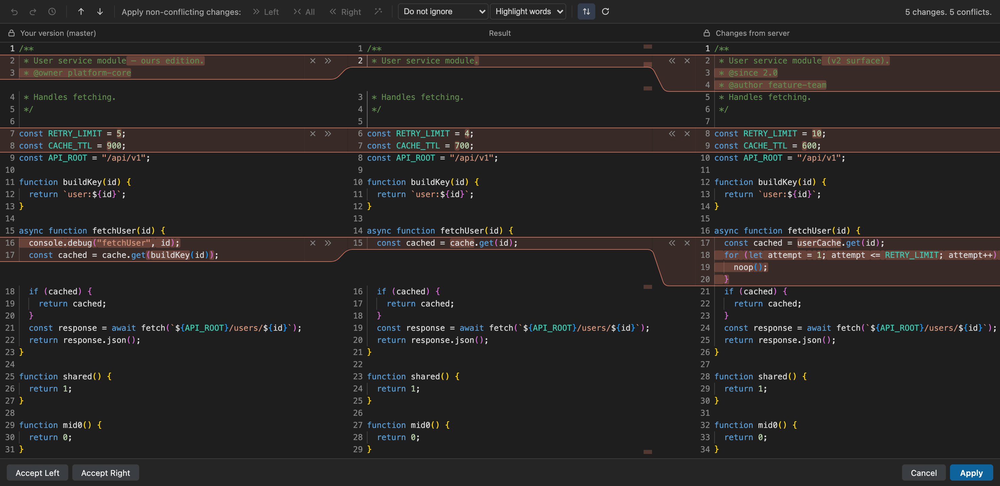
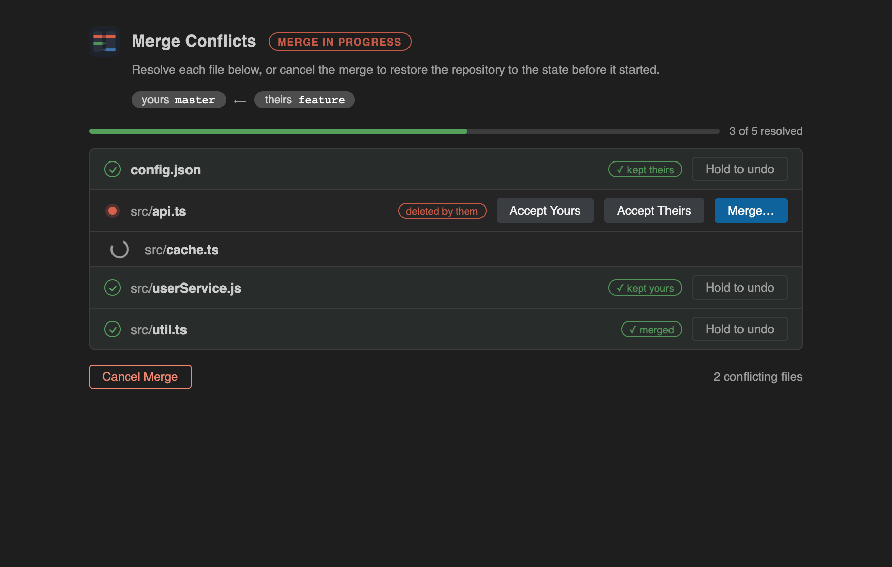
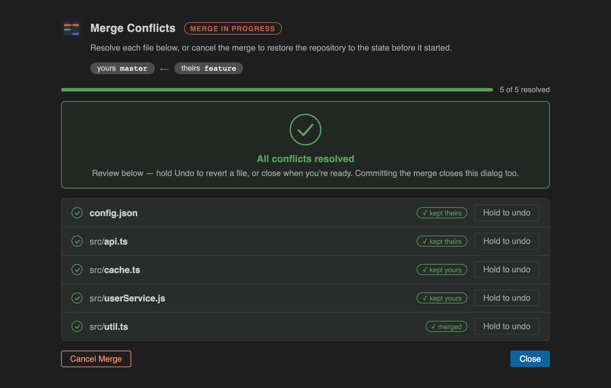

# Merge Studio — JetBrains-Style Merge & Diff

The **JetBrains (IntelliJ / PyCharm / WebStorm) merge-conflict experience, embedded in VS Code and Cursor**: a faithful 3-pane merge editor with curved gutter ribbons, a conflicts dialog that drives your whole merge session, undo/redo with action history, and a side-by-side diff viewer.

[](LICENSE)

> 100% free and open source (MIT). If Merge Studio saves your merges, consider [sponsoring the project](https://github.com/sponsors/antonarnaudov) ❤️



## Why

VS Code's built-in 3-way merge editor cannot be themed or replaced through any public API, and nothing on the marketplace reproduces the JetBrains merge workflow. Merge Studio self-renders that experience inside the editor using Monaco — and if you have a real JetBrains IDE installed, it can hand the merge to it instead.

## Features

### Conflicts dialog

The moment a merge, rebase, cherry-pick, or revert produces conflicts, the **Conflicts** page opens — instantly, via direct `.git` operation-state watchers rather than the slower git extension poll:



- Every conflicted file listed with **Accept Yours · Accept Theirs · Merge…** actions
- **Resolved files stay in the list** — green and check-marked, labeled with how they were settled (kept yours / kept theirs / merged)
- **Hold-to-undo** on every resolved file: hold for 1.5s and `git checkout -m` restores the original conflict — even for files resolved in the merge editor
- Branch context (`yours master ⟵ theirs feature`) and a live progress bar
- When everything is resolved: a green confirmation with a Close button — files stay reviewable and undoable until you commit; committing or cancelling closes the dialog automatically
- **Cancel Merge** aborts the operation and restores the repository to its pre-merge state (works for merge, rebase, cherry-pick, and revert)
- A ⚠ **Resolve Conflicts** status-bar button while any conflicts remain



### 3-way merge editor

Left (yours) · Result (editable) · Right (theirs), exactly like the IntelliJ merge dialog:

- Two-intensity glassy change highlighting that keeps syntax colors readable
- Curved gutter **ribbons** connecting changes across panes, with crisp conflict frames
- Per-side resolution: apply (≫/≪), append (Ctrl-click), or ignore (✕) each side independently — and the Accept Left/Right button that settles the merge lights up with a green check
- Apply all non-conflicting changes (left / right / all), magic-wand for identical edits
- **Undo/redo with action history** — ⌘Z / ⇧⌘Z (Ctrl+Z / Ctrl+Shift+Z), toolbar buttons, and a history dropdown listing every action by name
- Change navigation (F7 / Shift+F7), synchronized scrolling, whitespace modes, large-file fallback
- Conflicted files route into the merge editor automatically when opened

### Side-by-side diff

- Explorer: compare any two files, or a file against its git HEAD
- Live re-diff while you edit the right pane
- Same ribbons, colors, and navigation as the merge editor

### Real JetBrains IDE integration (optional)

If a JetBrains IDE is installed — WebStorm, PyCharm, IntelliJ IDEA, PhpStorm, GoLand, CLion, Rider, RubyMine, or DataGrip — Merge Studio can shell out to the **real** IDE merge window (`jbMerge.conflictResolver: "jetbrains"`), auto-detecting the IDE from PATH or /Applications.

## Install

- **VS Code**: search "Merge Studio" in the Extensions view, or `ext install anton-arnaudov.merge-studio`
- **Cursor / VSCodium**: install from the marketplace, or download the `.vsix` from [GitHub releases](https://github.com/antonarnaudov/merge-studio/releases) and use "Install from VSIX…"

**Requirements**: VS Code 1.74+ (or Cursor), git on your PATH, and the built-in Git extension enabled. Merge Studio runs where your repository lives, so it needs a trusted, local (non-virtual) workspace.

## Settings

| Setting | Default | Description |
| --- | --- | --- |
| `jbMerge.conflictResolver` | `webview` | `webview` = embedded editor, `jetbrains` = launch the real installed IDE |
| `jbMerge.autoOpen` | `true` | Automatically open conflicted files with the selected resolver |
| `jbMerge.preferredIde` | `auto` | Which JetBrains IDE to launch (`auto` picks the first found) |
| `jbMerge.jetbrainsPath` | `""` | Explicit path to a JetBrains IDE launcher |

## Development

```bash
npm install           # install dependencies
npm run watch         # incremental build (extension + webview)
# Press F5 in VS Code to launch the Extension Development Host

npm test              # pure-logic unit tests
npm run check-types   # TypeScript type-check
npx @vscode/vsce package   # build the .vsix
```

| Layer | Responsibility |
| --- | --- |
| `src/extension.ts` | Activation, commands, auto-open routing, conflicts watcher |
| `src/conflictsPanel.ts` | The Conflicts dialog (webview) |
| `src/mergeEditorProvider.ts` | `CustomTextEditorProvider` hosting the merge webview |
| `src/git/` | git service, merge ops (accept side / abort), abort flow |
| `src/jetbrains/` | Real-IDE detection and shell-out |
| `src/engine/` | Diff/merge model (pure, unit-tested) |
| `webview/` | Front-end: Monaco panes, ribbons, decorations, undo history |

## Sponsor

Merge Studio is free, MIT-licensed, and built nights-and-weekends. If it makes your merges painless, [a sponsorship or tip](https://github.com/sponsors/antonarnaudov) keeps it maintained and motivates new features.

## License

[MIT](LICENSE)
